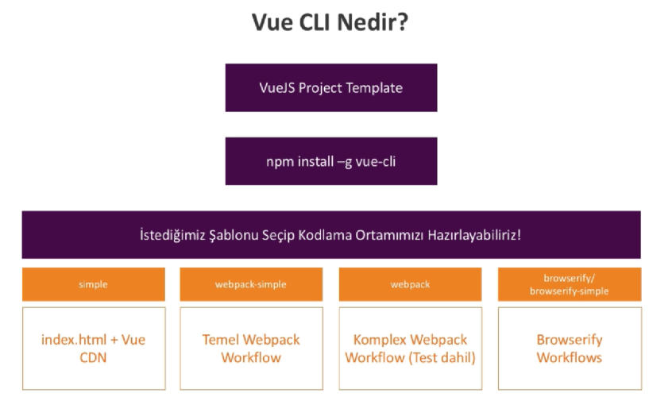
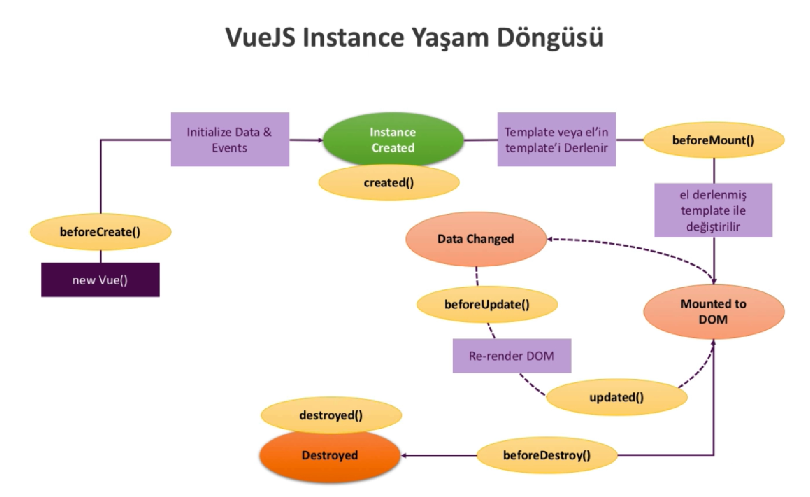

# VueJS Nedir [VueJS](https://vuejs.org/v2/guide/)

- Kullanıcı dostudur.
- Çok kullanışlıdır.
- Çok yönlüdür.
- Performanslıdır (Angular ve Reacttan daha performanslı)
- Sürdürülebilirdir.
- Test edilebilir.

> - VueJS bir prograssive Frameworktür.
> - Reusable Components

[Vue, React, Angular Hangisini Seçmeliyim?](http://vuejsegitim.com/vue-react-angular-hangisini-secmeliyim/)

> `npm install -g vue-cli`
>
> `npm install -g @vue/cli-init`
> 
> `npm install -g @vue/cli-service-global`

> Eski kod ==> `vue init webpack-simple app-name`

> `vue create app-name`
>
> 

# Directive

__v-on__ : Eventi yakalamak için kullanılan directive. Kısaltma @

__v-bind__ : kısaltması :

__v-once__ : İlk renderdan sonra html içerisinde nasıl kalmasını istiyorsak öyle gösterilmesi.

__v-html__ : HTML içeriğinin body tagları arasında bastırılmasını sağlar.

__v-model__ : Two way binding

# Event Modifiers - [Modifiers](https://vuejs.org/v2/guide/events.html#Event-Modifiers)

- .stop
- .prevent
- .capture
- .self
- .once
- .passive

# v-if ile v-show - v-for

v-if : dom üzerinden kaldırılmasını yada eklenmesini istiyorsanız kullanılır.

v-show : Uygulamada dom üzerinde dom üzerinde pasif olarak durmasını istiyorsanız kullanılır.

v-for : listeler içerisinde dönmek için

# VueJS Life Cycle

# Daha Fazla Link:

Resmi Döküman - Başlangıç: http://vuejs.org/guide/

Resmi Döküman - API: https://vuejs.org/v2/api/

Resmi Döküman - Template Syntax: http://vuejs.org/guide/syntax.html

Resmi Döküman - Events: http://vuejs.org/guide/events.html

Resmi Döküman - Computed Properties & Watchers: http://vuejs.org/guide/computed.html

Resmi Döküman - Class ve Style Binding: http://vuejs.org/guide/class-and-style.html

Resmi Döküman - Koşullar: https://vuejs.org/v2/guide/conditional.html

Resmi Döküman - Listeler: https://vuejs.org/v2/guide/list.html

Resmi Döküman - Vue Instance: https://vuejs.org/v2/guide/instance.html

vue uzantılı dosyalar ile ilgili daha fazla bilgi almak için VueJS’ in resmî web sayfasına göz atabilirsiniz : http://vuejs.org/guide/single-file-components.html

render() metodu ice ilgili data faze bilge almak icing VueJS’in resmî web sayfasına göz atabilirsiniz: http://vuejs.org/guide/render-function.html

Kullanabileceğimiz 2 Farklı Developer Tools var;

1) Chome Developer tools 

2) Vue Developer Tools (https://github.com/vuejs/vue-devtools)

CLI ile üretilmiş bir proje ile çalışırken (webpack), çalışan uygulamamızı Developer Tools kullanarak kolaylıkla debug edebiliriz.
